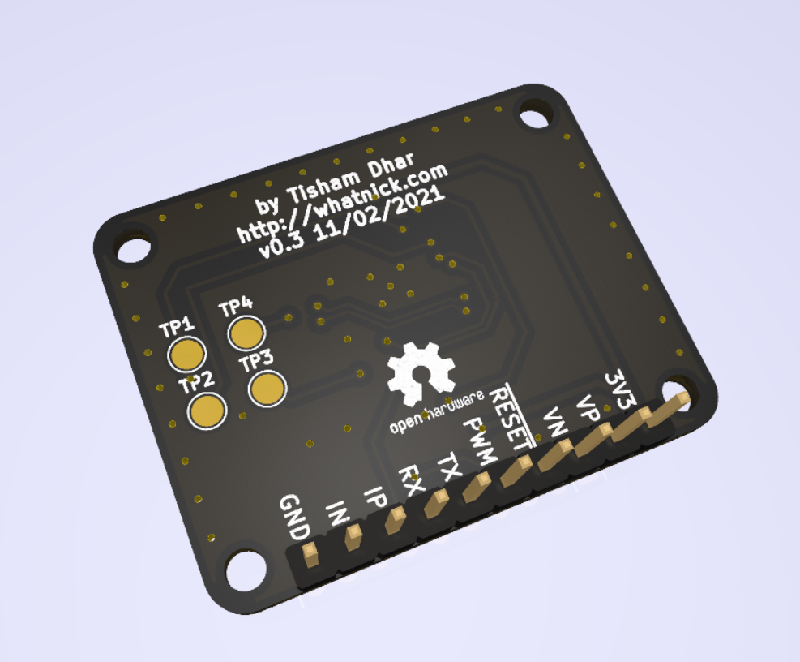

# MCP39F511 Breakout

[MCP39F511](https://www.digikey.com.au/product-detail/en/microchip-technology/MCP39F511-E-MQ/MCP39F511-E-MQ-ND/5323591) Energy Monitor ASIC Breakout

KiCAD model from [SnapEDA](https://www.snapeda.com/parts/MCP39F511-E/MQ/Microchip/view-part/?ref=digikey)

## Board Renders

This board is available via :

- [Tindie](https://www.tindie.com/products/whatnick/mcp39f511-breakout/)
- [OSHPark]()
- [Aisler]()
- [PCBWay]()

